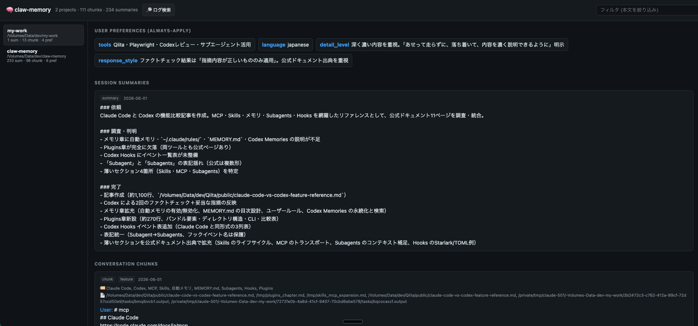

# claw-memory

[English](README.md) | **日本語**



**AI コーディングエージェント（Claude Code / Codex）のためのローカル完結型・長期記憶。**
エージェントが過去のセッション・あなたの好み・以前の決定事項を記憶し、記録済みの全
トランスクリプトを横断検索できます。デーモン不要、Python 不要、外部ベクトル DB 不要。
データは一切マシン外に出ません（セッションを要約する LLM 呼び出しのみ外部で、これも
あなたが選択・制御します）。

```bash
npm install -g @nogataka/claw-memory
```

- **ストレージ**: `better-sqlite3` + `sqlite-vec` — ベクトルを 1 つの SQLite ファイル内に格納
- **埋め込み**: ローカルの `Xenova/multilingual-e5-small`（384次元・多言語・オフライン）
- **2 つの記憶ソース**: 蒸留済みのセマンティック DB と、Claude Code / Codex の生ログ全文検索
- **自動取り込み**: フックで終了済みセッションを蒸留し、新しいセッションへ関連記憶を注入
- **差し替え可能な LLM**: Claude / Codex のサブスクリプション（API キー不要）、または任意の
  Anthropic / OpenAI 互換エンドポイントで蒸留

---

## 目次

- [機能](#機能)
- [インストールガイド](#インストールガイド)
- [MCP ツール](#mcp-ツール)
- [設定（環境変数）](#設定環境変数)
- [CLI リファレンス](#cli-リファレンス)
- [仕組み](#仕組み)
- [メモリビューア](#メモリビューア)
- [アンインストール](#アンインストール)
- [補足](#補足)

---

## 機能

### 1. 2 つの独立した記憶ソース

| ソース | 内容 | ツール |
|--------|------|--------|
| **蒸留 DB** | LLM がセッションを要約 → 要約・好み・構造化メタデータ付きの埋め込みチャンク。セマンティック検索可能。 | `memory_recall`, `memory_search`, `memory_get` |
| **生ログ検索** | 実際の Claude Code（`~/.claude/projects`）/ Codex（`~/.codex/sessions`）ログを全文検索。蒸留していないセッションも対象。 | `memory_search_logs` |

蒸留 DB は整理済みで高速に想起でき、生ログ検索は claw-memory 導入前を含め「いつか話した
こと」を必ず見つけられるセーフティネットです。

### 2. 自動取り込み（distill）

セッション終了時、トランスクリプトを次の形に蒸留します。

- **構造化要約**（`### 依頼 / 調査・判明 / 完了 / 次の一手`）
- **ユーザーの好み**（言語・回答スタイル・フレームワーク・口調 など）を常時適用コンテキストとして保存
- **会話チャンク**をセマンティック検索用に埋め込み。各チャンクには
  **observation type**（`discovery` / `bugfix` / `feature` / `decision` / `change`）、
  **concepts**、**読んだ/編集したファイル** を付与

蒸留は **増分的**（watermark で新規内容のないセッションをスキップ）かつ **冪等**
（再蒸留は置換であり重複しない）。クロスセッションの重複チャンクも排除します。

### 3. 自動 recall 注入

セッション開始時（および各プロンプト時）に記憶ブロックを注入します。

- **好み** は `instruction="always-apply"` — エージェントが必ず従います。
- **直近の要約 + 類似する過去会話** は `instruction="reference-only"` — 背景として扱い、
  不必要に蒸し返しません。

これにより、文脈を再説明しなくても続きから作業できます。

### 4. 構造化されたフィルタ検索

`memory_search` はトークン軽量なインデックス（id + タイトル + 日付 + type）を返します。
`type` / `concept` / `file` / 日付範囲で絞り込み、必要なものだけ `memory_get` で本文取得 —
コンテキスト消費を最小化します。

### 5. プライバシーと安全性（設計段階から）

- **完全ローカル**: ストレージと埋め込みはマシン外に出ません。`distill` のみ LLM を呼び、
  どの LLM を使うかはあなたが選択します。
- **`<private>…</private>`** で囲んだ区間は、保存・LLM 送信の前に除去されます。
- **`CLAW_MEMORY_EXCLUDED_PROJECTS`**: 指定パスは記録も想起もしません。
- **`memory_forget`**: チャンクをソフト削除。検索・recall・ビューアから消えます。

### 6. 差し替え可能な LLM バックエンド（distill のみ）

サブスクリプションログイン（API キー不要）や任意の HTTP エンドポイントを利用できます
（[設定](#設定環境変数)参照）。tier ルーティングで、高頻度な distill を安価なモデルに
振り分けられます。

### 7. オンデマンドな Web ビューア

ビルド不要・読み取り専用のビューア（`claw-memory ui`）。プロジェクト・要約・チャンク
（メタデータ付き）・好みを閲覧でき、生ログ検索も実行できます。SSE で開いている間は自動
更新。起動した時だけ動きます。抽出されたレッスンをレビュー・承認・編集できる **Lessons**
タブも備えています。

### 8. 再利用可能なレッスン

過去ログをそのまま検索するだけでなく、claw-memory は AI コーディングセッションを
**再利用可能なレッスン**へと蒸留します。プロジェクト固有の制約、デバッグパターン、設計
判断、ユーザーの開発方針などの、実行可能で抽象化された知識です。レッスンは通常の要約と
同時に抽出され（追加の LLM 呼び出しなし）、ローカルに保存され、同じローカルモデルで埋め込
まれ、（承認後のみ）類似タスク時に想起されます。各レッスンは `scope`・`confidence`・
`applies_when` / `avoid_when` と、ライフサイクル（candidate → approved → archived /
superseded）を持ち、重複・矛盾検出と時間経過による confidence 減衰を備えます。raw ログは
根拠として保持しつつ、通常の想起では簡潔で再利用可能なレッスンを優先します。

---

## インストールガイド

### 前提条件

- **Node.js 20 以上**
- サブスクリプション LLM バックエンドを使う場合: **Claude Code CLI**（ログイン済み）/ **Codex CLI**（ログイン済み）
- 初回 `distill` 時に埋め込みモデル（約 100 MB、`~/.cache` にキャッシュ）をダウンロード

### 手順 1 — パッケージをグローバルインストール

```bash
npm install -g @nogataka/claw-memory
```

グローバル導入によりフックと MCP サーバーが即座に起動します（未導入時はプラグインが
`npx -y @nogataka/claw-memory@latest` にフォールバックし、初回が遅くなります）。

### 手順 2a — Claude Code（プラグイン、推奨）

```text
/plugin marketplace add nogataka/claw-memory
/plugin install claw-memory
```

Claude Code を再起動してください。次が自動登録されます。

- **MCP サーバー**（8 つの記憶ツール）
- **フック**: `SessionStart` / `UserPromptSubmit` → recall 注入、`Stop` → 自動 distill

手動設定は不要です。確認は `/mcp` で `claw-memory` が見えるかどうかで行えます。

> **プラグインを使わない場合**: `claw-memory install --claude-code` で MCP サーバーと
> フックを `~/.claude/settings.json` にマージできます（冪等・バックアップ付き）。

### 手順 2b — Codex（プラグイン）

Codex は Claude Code と同じプラグイン形式に対応しています。claw-memory は
`.codex-plugin/plugin.json` を同梱しているため、Codex プラグインとして導入すると
MCP サーバーと**ライフサイクル hooks の両方**が登録され、Claude Code と同等になります。

```
codex
/plugins
```

プラグインは Codex が互換提供する `${CLAUDE_PLUGIN_ROOT}` を介して次を登録します。

- `claw-memory` MCP サーバー（`.mcp.json`）
- `SessionStart` / `UserPromptSubmit` → **recall 自動注入**（memory ブロックを developer context として）
- `Stop` → 最近の Codex セッションの**自動 distill**（watermark 重複回避・非同期）
- `memory-recall` skill

### 手順 2b（代替）— Codex（インストーラ／マーケット非経由）

マーケットプレイスではなく npm から導入する場合は CLI で登録します。

```bash
claw-memory install --codex
```

これは冪等に次を行います。

- `~/.codex/config.toml` に `[mcp_servers.claw-memory]` を追記（`config.toml.bak` にバックアップ）
- `~/.codex/hooks.json` に recall/distill hooks をマージ（バックアップあり・既存 hook は保全）
- `memory-recall` skill を配置
- `AGENTS.md` に「セッション冒頭で `memory_recall` を呼ぶ」指示を追記

Codex を再起動してください。**recall 注入・自動 distill は hooks で自動実行**され、手動操作は不要です。
必要に応じて手動バックフィルも可能です。

```bash
claw-memory distill-codex --recent     # 最近の Codex セッションを蒸留（watermark で重複回避）
claw-memory distill-codex --all        # 全件バックフィル
```

### 手順 2c — ソースから（開発）

```bash
git clone https://github.com/nogataka/claw-memory
cd claw-memory
npm install          # ネイティブの better-sqlite3 / sqlite-vec をビルド
npm run build        # tsc -> dist/
npm link             # 任意: `claw-memory` バイナリを公開
```

---

## MCP ツール

| ツール | 用途 |
|--------|------|
| `memory_recall(query, cwd?, topK?)` | すぐ読めるコンテキストブロック: 好み + 直近要約 + 類似する過去会話。タスク開始時に呼ぶ。 |
| `memory_search(query, cwd?, limit?, type?, concept?, file?, dateFrom?, dateTo?)` | トークン軽量なヒットインデックス（id + タイトル + 日付 + type）。メタデータで絞り込み。 |
| `memory_get(ids)` | 指定 id の本文 + メタデータを取得。 |
| `memory_remember(text, cwd?, sessionId?)` | フリーテキストのメモを永続保存。 |
| `memory_distill(cwd, sessionId? \| transcriptPath?)` | セッションを要約して記憶化（LLM バックエンドが必要）。 |
| `memory_get_preferences(cwd?)` | プロジェクトの保存済み好みを一覧。 |
| `memory_search_logs(query, sources?, projectPath?, startDate?, endDate?, limit?, offset?)` | Claude Code + Codex の生ログを全文検索。 |
| `memory_forget(ids)` | チャンクをソフト削除（検索 / recall / ビューアから除外）。 |
| `lesson_search(query, cwd?, limit?)` | 承認済みレッスンを関連度 + scope + confidence で検索。 |
| `lesson_inject(query, cwd?, limit?)` | 同上を `<relevant-lessons>` ブロックとして返す。 |
| `lesson_get(lesson_id)` | レッスン1件の詳細（全フィールド + 履歴 + リンク）。 |
| `lesson_extract(cwd, sessionId? \| transcriptPath?)` | セッションから専用のレッスン抽出（LLM 必要）。 |
| `lesson_approve / lesson_reject / lesson_archive(lesson_id, reason?)` | ステータス遷移。 |
| `lesson_supersede(old_lesson_id, new_lesson_id)` | 古いレッスンを新しいもので置き換え。 |

`memory_distill` / `lesson_extract`（LLM）と `memory_search_logs`
（`~/.claude/projects`・`~/.codex/sessions` を直接読む）以外は完全ローカルで動作します。

---

## 設定（環境変数）

| 変数 | 既定値 | 用途 |
|------|--------|------|
| `CLAW_MEMORY_DIR` | `~/.claw-memory` | データディレクトリ（`memory.db` と `logs/`）。 |
| `CLAW_MEMORY_LLM_BACKEND` | `agent-sdk` | `agent-sdk` \| `codex-sdk` \| `anthropic` \| `openai-compatible`。 |
| `CLAW_MEMORY_MODEL` / `AGENT_SDK_MODEL` | `claude-sonnet-4-5` | 既定の distill モデル（agent-sdk / anthropic）。 |
| `CLAW_MEMORY_TIER_SMART` / `_SUMMARY` / `_SIMPLE` | — | tier 別モデル上書き（安価モデルを単純作業へ）。 |
| `CLAW_MEMORY_CODEX_MODEL` | Codex 既定 | `codex-sdk` バックエンドのモデル。 |
| `CLAW_MEMORY_CODEX_API_KEY` | — | 任意。未設定なら Codex CLI のログインを使用。 |
| `ANTHROPIC_API_KEY` / `ANTHROPIC_BASE_URL` | — | `anthropic` バックエンド用。 |
| `CLAW_MEMORY_OPENAI_API_KEY` / `CLAW_MEMORY_OPENAI_BASE_URL` | — | `openai-compatible` 用（Gemini / OpenRouter / LM Studio）。 |
| `CLAW_MEMORY_EXCLUDED_PROJECTS` | — | 記録・想起しないパス部分文字列（カンマ/コロン区切り）。 |
| `MEMORY_SIMILARITY_MAX_DISTANCE` | `0.6` | セマンティックヒットの最大コサイン距離（小さいほど厳格）。 |
| `CLAW_MEMORY_UI_PORT` | `4319` | ビューアのポート。 |
| `LESSON_RECALL_LIMIT` | `3` | recall ブロックに注入する承認済みレッスン数（`0` で無効）。 |
| `CLAW_MEMORY_LESSON_DEDICATED` | — | `1` で専用の高品質レッスン抽出パスを実行（LLM 追加呼び出し）。 |
| `CLAW_MEMORY_LESSON_CONFLICT_LLM` | — | `1` で抽出時に LLM による矛盾検出を有効化。 |
| `LESSON_DECAY_FACTOR` / `LESSON_STALE_DAYS` | `0.9` / `30` | `lessons decay` の減衰係数と陳腐化しきい値。 |

### LLM バックエンド

| バックエンド | 認証 | 備考 |
|--------------|------|------|
| `agent-sdk`（既定） | Claude CLI ログイン（Pro/Max/Team/Enterprise） | ゼロ設定・API キー不要 |
| `codex-sdk` | Codex CLI ログイン（ChatGPT/Codex プラン） | `@openai/codex-sdk`。read-only・ツール無効で実行 |
| `anthropic` | `ANTHROPIC_API_KEY` | fetch ベースの Messages API |
| `openai-compatible` | `CLAW_MEMORY_OPENAI_API_KEY` + ベース URL + `CLAW_MEMORY_MODEL` | Gemini / OpenRouter / LM Studio |

```bash
export CLAW_MEMORY_LLM_BACKEND=codex-sdk   # Codex サブスクリプションで distill
```

---

## CLI リファレンス

```bash
claw-memory mcp                                  # stdio MCP サーバー（エージェントが起動するもの）
claw-memory ui [--port N] [--open]               # 読み取り専用 Web ビューア
claw-memory distill --cwd P --session ID [--path FILE] [--if-stale]
claw-memory distill-codex [--recent] [--limit N] [--all]
claw-memory remember --cwd P "メモ"
claw-memory lessons list [--status candidate|approved|...] [--cwd P]
claw-memory lessons search "クエリ" [--cwd P] [--limit N]
claw-memory lessons inject "クエリ" [--cwd P] [--limit N]
claw-memory lessons extract --session ID [--cwd P] [--path FILE]
claw-memory lessons approve|reject|archive <lesson_id> [--reason R]
claw-memory lessons supersede <old_id> <new_id>
claw-memory lessons decay [--days N] [--factor F] [--dry]
claw-memory lessons export [--status S] [--cwd P] > bundle.json
claw-memory lessons import bundle.json [--status S] [--cwd P]
claw-memory search-logs "クエリ" [--source claude-code,codex] [--project P]
                                 [--start ISO] [--end ISO] [--limit N] [--offset N]
claw-memory hook <recall|distill>               # ライフサイクルフック（JSON を stdin で受領）
claw-memory install   [--codex | --claude-code] # MCP + フックを登録（既定: codex）
claw-memory uninstall [--codex | --claude-code]
```

---

## 仕組み

```
[書き込み側]                                 [読み出し側]
セッション終了 (Stop フック / distill-codex)   セッション開始 (SessionStart フック / memory_recall)
   └ distill                                     └ buildMemoryBlock
       ├ 要約 ───────────────► session_summaries ──► <previous-session-summaries>
       ├ 好み ───────────────► user_preferences ───► <user-preferences>（always-apply）
       └ チャンク(埋込+メタ) ─► vec_chunks + ────────► <relevant-past-conversations>
                                conversation_chunks    （コサイン KNN・プロジェクト/メタ絞り込み）

[別ソース] 生ログ (~/.claude/projects, ~/.codex/sessions) ──► memory_search_logs
```

- **単一の SQLite ファイル** `~/.claw-memory/memory.db`。`sqlite-vec` が 384 次元ベクトルを
  内包し、メタデータは並列テーブル、FTS5 がキーワード fallback を提供。
- **埋め込み** はローカルの `Xenova/multilingual-e5-small`（多言語・オフライン・e5 の
  `query:`/`passage:` プレフィックス遵守）。モデルは MCP プロセスごとに 1 回ロード。
- **検索** はハイブリッド: コサイン KNN（プロジェクト + メタデータで絞り込み）を FTS5 の
  キーワードヒットで補強し、重複排除して距離順にソート。
- 構造化された日次ログを `~/.claw-memory/logs/` に出力。

---

## メモリビューア

```bash
claw-memory ui --open        # http://localhost:4319
```

**Claude Code プラグインだけ**で導入した場合（グローバル npm 未導入）、`claw-memory`
コマンドは `PATH` に乗りません。その場合は `npx` 経由で起動してください。

```bash
npx @nogataka/claw-memory ui --open       # http://localhost:4319
npx @nogataka/claw-memory ui --port 5000 --open
```

読み取り専用。プロジェクト・要約・会話チャンク（type / concepts / files 付き）・好みを
閲覧でき、**🔎 ログ検索** で Claude Code + Codex の生ログを全文検索できます。開いている間
は SSE で自動更新。それ以外はバックグラウンドで何も動きません — 確認したい時だけ起動して
ください。

---

## アンインストール

```bash
claw-memory uninstall --codex          # config.toml ブロック + hooks + skill + AGENTS 記述を除去
claw-memory uninstall --claude-code    # settings.json から mcp + フックを除去
# Claude Code プラグイン: /plugin uninstall claw-memory
npm uninstall -g @nogataka/claw-memory
```

メモリ DB は残ります。完全に消す場合は `~/.claw-memory` を削除してください。

---

## 補足

- `better-sqlite3` / `sqlite-vec` はネイティブモジュールです。Node の ABI 変更後は `npm rebuild` を実行してください。
- MCP サーバーはエージェントセッションごとに常駐するため、埋め込みモデルは 1 回だけロードされます。
- ビューアと MCP は同時実行できます（SQLite WAL が並行読み書きを処理）。
- インストール時、依存は `legacy-peer-deps=true` で解決されます（同梱 SDK 間の zod の
  peer 範囲の重なりによるもの）。`.npmrc` に設定済みで無害です。
